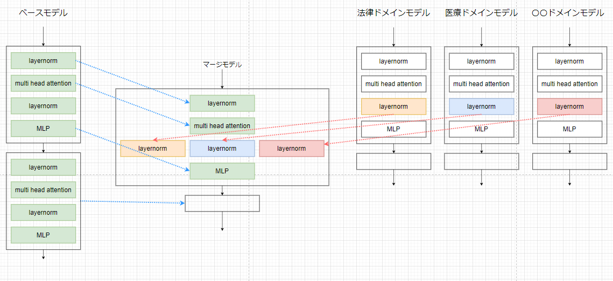

# README
sampleとしてphi2をベースに、同じphi2を2つマージします

https://huggingface.co/if001/sample_phi-2


マージイメージ



## merge

```sh
python ./mergekit/scripts/mixtral_moe.py \
"./examples/phi2-sample.yaml" \
"./sample_output" \
--i-understand-this-is-not-useful-without-training
```


configは以下

```sh
cat examples/phi2-sample.yaml
base_model: if001/sample_phi-2
tokenizer: microsoft/phi-2
gate_mode: cheap_embed
experts:
  - source_model: if001/sample_phi-2
    positive_prompts: ["for model1"]
  - source_model: if001/sample_phi-2
    positive_prompts: ["for model2"]
```

## load
`./sample_output`以下にマージされたモデルが出力されるので、以下でロードして確認

`python sample_load.py`

```
MixtralForCausalLM(
  (model): MixtralModel(
    (embed_tokens): Embedding(51200, 8)
    (layers): ModuleList(
      (0-5): 6 x MixtralDecoderLayer(
        (self_attn): MixtralSdpaAttention(
          (q_proj): Linear(in_features=8, out_features=8, bias=False)
          (k_proj): Linear(in_features=8, out_features=4, bias=False)
          (v_proj): Linear(in_features=8, out_features=4, bias=False)
          (o_proj): Linear(in_features=8, out_features=8, bias=False)
          (rotary_emb): MixtralRotaryEmbedding()
        )
        (block_sparse_moe): MixtralSparseMoeBlock(
          (gate): Linear(in_features=8, out_features=2, bias=False)
          (experts): ModuleList(
            (0-1): 2 x MixtralBlockSparseTop2MLP(
              (w1): Linear(in_features=8, out_features=10, bias=False)
              (w2): Linear(in_features=10, out_features=8, bias=False)
              (w3): Linear(in_features=8, out_features=10, bias=False)
              (act_fn): NewGELUActivation()
            )
          )
        )
        (input_layernorm): MixtralRMSNorm()
        (post_attention_layernorm): MixtralRMSNorm()
      )
    )
    (norm): MixtralRMSNorm()
  )
  (lm_head): Linear(in_features=8, out_features=51200, bias=False)
)
```

## phi2 upload
小さいサイズにして、weightをランダムに初期化してuploadしてます。
以下参照
`./phi-2/uploda.py`

## diff
phi2ベースでphi2をマージできるように変更

```sh
$ git diff mergekit/architecture.py
diff --git a/mergekit/architecture.py b/mergekit/architecture.py
index d99f65a..39c5516 100644
--- a/mergekit/architecture.py
+++ b/mergekit/architecture.py
@@ -308,8 +308,8 @@ def _load_all_architectures() -> (


 JSON_ARCHITECTURES, NAME_TO_ARCH = _load_all_architectures()
-MISTRAL_INFO = _load_json_arch("mistral.json")
-
+# MISTRAL_INFO = _load_json_arch("mistral.json")
+MISTRAL_INFO = _load_json_arch("phi2.json")
```